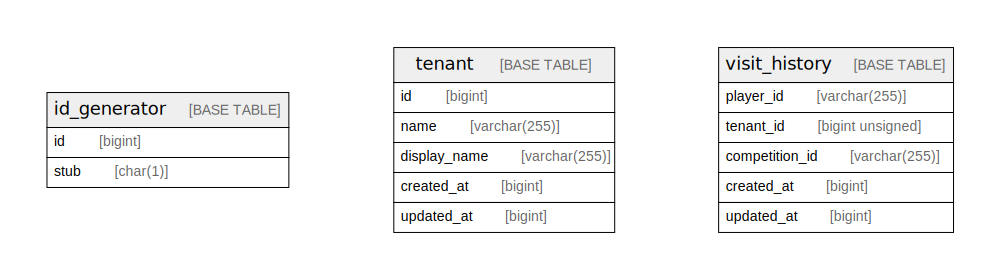

# isuports

## Tables

| Name | Columns | Comment | Type |
| ---- | ------- | ------- | ---- |
| [id_generator](id_generator.md) | 2 |  | BASE TABLE |
| [tenant](tenant.md) | 5 |  | BASE TABLE |
| [visit_history](visit_history.md) | 5 |  | BASE TABLE |

## Relations

---

> Generated by [tbls](https://github.com/k1LoW/tbls)
