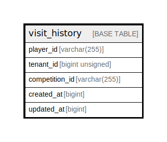

# visit_history

## Description

<details>
<summary><strong>Table Definition</strong></summary>

```sql
CREATE TABLE `visit_history` (
  `player_id` varchar(255) NOT NULL,
  `tenant_id` bigint unsigned NOT NULL,
  `competition_id` varchar(255) NOT NULL,
  `created_at` bigint NOT NULL,
  `updated_at` bigint NOT NULL,
  KEY `tenant_id_idx` (`tenant_id`)
) ENGINE=InnoDB DEFAULT CHARSET=utf8mb4 COLLATE=utf8mb4_0900_ai_ci
```

</details>

## Columns

| Name | Type | Default | Nullable | Children | Parents | Comment |
| ---- | ---- | ------- | -------- | -------- | ------- | ------- |
| player_id | varchar(255) |  | false |  |  |  |
| tenant_id | bigint unsigned |  | false |  |  |  |
| competition_id | varchar(255) |  | false |  |  |  |
| created_at | bigint |  | false |  |  |  |
| updated_at | bigint |  | false |  |  |  |

## Indexes

| Name | Definition |
| ---- | ---------- |
| tenant_id_idx | KEY tenant_id_idx (tenant_id) USING BTREE |

## Relations



---

> Generated by [tbls](https://github.com/k1LoW/tbls)
